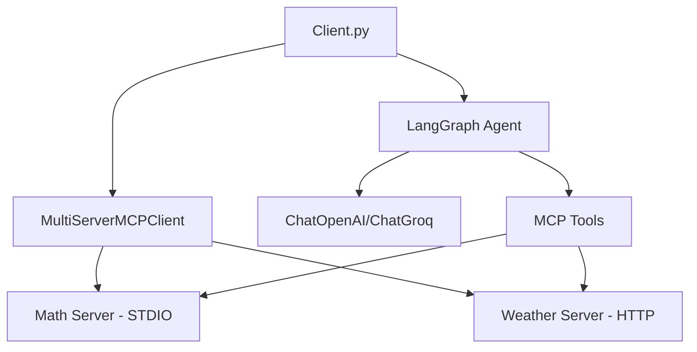

# MCP LangChain Integration

A comprehensive implementation of **Model Context Protocol (MCP)** servers and client using **LangChain** and **LangGraph**. This project demonstrates how to create and integrate MCP servers for different functionalities (Math operations and Weather data) with a LangChain-powered agent.

## 🚀 Features

- **Multi-Server MCP Client**: Connects to multiple MCP servers simultaneously
- **Math Server**: Provides mathematical operations via MCP
- **Weather Server**: Fetches real-time weather data via OpenWeatherMap API
- **LangGraph Agent**: Uses ReAct pattern for tool calling and reasoning
- **Multiple LLM Support**: Compatible with OpenAI GPT-4o and Groq models

## 📋 Table of Contents

- [Architecture Overview](#architecture-overview)
- [Installation & Setup](#installation--setup)
- [Environment Configuration](#environment-configuration)
- [Running the Project](#running-the-project)
- [Project Structure](#project-structure)
- [How It Works](#how-it-works)
- [MCP Servers Explained](#mcp-servers-explained)
- [References & Documentation](#references--documentation)
- [Contributing](#contributing)

## 🏗️ Architecture Overview



The project follows the **Model Context Protocol (MCP)** specification, allowing AI models to securely access external tools and data sources. Our implementation uses:

- **LangChain** for LLM orchestration and tool management
- **LangGraph** for building reactive agents with reasoning capabilities
- **MCP Adapters** for seamless integration between MCP servers and LangChain

## 🛠️ Installation & Setup

### Prerequisites

- Python 3.11 or higher
- OpenWeatherMap API key (free tier available)
- OpenAI API key or Groq API key

### 1. Clone the Repository

```bash
git clone https://github.com/Navashub/AI-Agents.git
cd AI-Agents/mcplangchain
```

### 2. Install Dependencies

Using uv (recommended):
```bash
uv sync
```

Or using pip:
```bash
pip install -r requirements.txt
```

### 3. Environment Configuration

Create a `.env` file in the project root:

```bash
touch .env
```

Add the following environment variables:

```env
# OpenAI Configuration (choose one)
OPENAI_API_KEY=your_openai_api_key_here

# OR Groq Configuration (alternative)
GROQ_API_KEY=your_groq_api_key_here

# Weather API Configuration
OPENWEATHER_API_KEY=your_openweathermap_api_key_here
```

#### Getting API Keys:

1. **OpenWeatherMap API Key**:
   - Visit [OpenWeatherMap](https://openweathermap.org/api)
   - Sign up for a free account
   - Navigate to API keys section
   - Copy your API key

2. **OpenAI API Key**:
   - Visit [OpenAI Platform](https://platform.openai.com/api-keys)
   - Create an account and add billing information
   - Generate a new API key

3. **Groq API Key** (Alternative to OpenAI):
   - Visit [Groq Console](https://console.groq.com/keys)
   - Sign up for a free account
   - Generate a new API key

## 🚀 Running the Project

### Start the Weather Server

In one terminal window:
```bash
python weather.py
```

The weather server will start on `http://localhost:8000/mcp/`

### Run the Client

In another terminal window:
```bash
python client.py
```

The client will:
1. Connect to both Math and Weather MCP servers
2. Create a LangGraph agent with the available tools
3. Execute sample queries (math calculation and weather lookup)
4. Display the results

### Expected Output

```
Math Response: The result of (3 + 5) * 12 is 96.

Weather Response: The weather in Nairobi is partly cloudy with a temperature of 22.5°C. The humidity is 65% and wind speed is 3.2 m/s. These conditions are excellent for driving a convertible car - the temperature is comfortable, it's not raining, and the wind is gentle.
```

## 📁 Project Structure

```
mcplangchain/
├── client.py           # Main MCP client with LangGraph agent
├── mathserver.py       # Math operations MCP server (STDIO transport)
├── weather.py          # Weather data MCP server (HTTP transport)
├── main.py            # Entry point placeholder
├── requirements.txt    # Project dependencies
├── pyproject.toml     # Project configuration
├── uv.lock           # Dependency lock file
├── .env              # Environment variables (create this)
└── README.md         # This documentation
```

## ⚙️ How It Works

### 1. MCP Protocol Implementation

The **Model Context Protocol (MCP)** enables secure, standardized connections between AI models and external tools. Our implementation creates:

- **MCP Servers**: Expose specific functionalities as tools
- **MCP Client**: Aggregates multiple servers and provides tools to the agent
- **Transport Layers**: STDIO for local processes, HTTP for network services

### 2. Multi-Server Architecture

```python
client = MultiServerMCPClient({
    "math": {
        "command": "python",
        "args": ["mathserver.py"],
        "transport": "stdio",
    },
    "weather": {
        "url": "http://localhost:8000/mcp/",
        "transport": "streamable_http",
    },
})
```

### 3. LangGraph Agent Integration

The client uses LangGraph's `create_react_agent` to:
- **Reasoning**: Analyze user queries and determine required tools
- **Action**: Execute appropriate MCP tools
- **Observation**: Process tool results
- **Response**: Generate natural language responses

### 4. Tool Execution Flow

1. User sends a query to the agent
2. Agent analyzes the query using the LLM
3. Agent identifies required tools from MCP servers
4. Agent executes tools through MCP protocol
5. Agent synthesizes results into a coherent response

## 🔧 MCP Servers Explained

### Math Server (`mathserver.py`)

- **Transport**: STDIO (Standard Input/Output)
- **Tools**: `add()`, `multiply()`
- **Use Cases**: Mathematical calculations, arithmetic operations

```python
@mcp.tool()
def add(a: int, b: int) -> int:
    """Add two numbers"""
    return a + b
```

### Weather Server (`weather.py`)

- **Transport**: HTTP (Streamable HTTP)
- **Tools**: `get_weather()`
- **API Integration**: OpenWeatherMap API
- **Use Cases**: Real-time weather data, location-based queries

```python
@mcp.tool()
async def get_weather(location: str) -> dict:
    """Get the current weather in a given location"""
    # Fetches real-time weather data
    return weather_data
```

## 📚 References & Documentation

### Core Technologies

- **[LangChain Documentation](https://python.langchain.com/docs/introduction/)**: Comprehensive guide to LangChain framework
- **[LangGraph Documentation](https://langchain-ai.github.io/langgraph/)**: Building stateful, multi-actor applications with LLMs
- **[Model Context Protocol (MCP)](https://modelcontextprotocol.io/)**: Official MCP specification and documentation

### Key Concepts

- **[ReAct Pattern](https://langchain-ai.github.io/langgraph/concepts/agentic_concepts/#react-implementation)**: Reasoning and Acting with language models
- **[Tool Calling](https://python.langchain.com/docs/concepts/tool_calling/)**: How LLMs interact with external tools
- **[Multi-Agent Systems](https://langchain-ai.github.io/langgraph/concepts/multi_agent/)**: Building complex AI workflows

### API References

- **[OpenWeatherMap API](https://openweathermap.org/api)**: Weather data API documentation
- **[OpenAI API](https://platform.openai.com/docs/api-reference)**: OpenAI GPT models API
- **[Groq API](https://console.groq.com/docs/quickstart)**: Groq LLM API documentation

### Advanced Topics

- **[FastMCP](https://github.com/modelcontextprotocol/python-sdk)**: Python SDK for building MCP servers
- **[MCP Adapters](https://github.com/langchain-ai/langchain-mcp-adapters)**: LangChain integration for MCP
- **[Async Programming](https://docs.python.org/3/library/asyncio.html)**: Python asyncio for concurrent operations

## 🔧 Customization & Extension

### Adding New MCP Servers

1. Create a new server file (e.g., `database_server.py`)
2. Define tools using `@mcp.tool()` decorator
3. Add server configuration to `client.py`
4. Update the agent with new tools

### Switching LLM Models

```python
# Use Groq instead of OpenAI
model = ChatGroq(model="qwen-qwq-32b")

# Or use different OpenAI models
model = ChatOpenAI(model="gpt-3.5-turbo", temperature=0.7)
```

### Adding Transport Types

MCP supports multiple transport mechanisms:
- **STDIO**: For local command-line tools
- **HTTP**: For web services and APIs
- **WebSocket**: For real-time communication

## 🤝 Contributing

1. Fork the repository
2. Create a feature branch: `git checkout -b feature-name`
3. Make your changes and add tests
4. Commit your changes: `git commit -am 'Add feature'`
5. Push to the branch: `git push origin feature-name`
6. Submit a pull request

## 📄 License

This project is part of the [AI-Agents](https://github.com/Navashub/AI-Agents) repository. Please refer to the main repository for license information.

## 🔍 Troubleshooting

### Common Issues

1. **Import Errors**: Ensure all dependencies are installed with correct versions
2. **API Key Issues**: Verify your API keys are correctly set in the `.env` file
3. **Port Conflicts**: Ensure port 8000 is available for the weather server
4. **Transport Errors**: Check that the weather server is running before starting the client

### Debug Mode

Enable debug logging by setting:
```python
import logging
logging.basicConfig(level=logging.DEBUG)
```

---

**Built with  using MCP, LangChain, and LangGraph**
